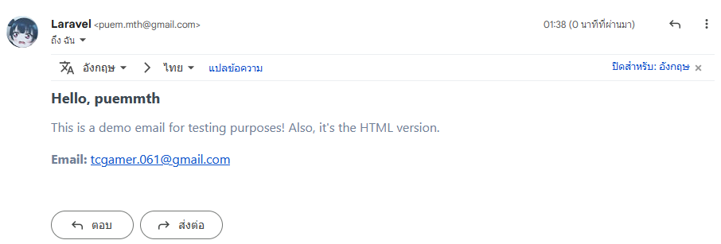

# Laravel Email

### Config Mail ใน Laravel
จากนั้นให้เปิดการเข้ารหัส 2 ขั้นตอนของ Email ที่เราใช้งาน ใน Google Account ของเรา โดยไปที่
```cmd
https://myaccount.google.com/security
```

จากนั้นก็ทำการสร้างรหัสผ่านสำหรับ App ของเรา โดยไปที่
```cmd
https://myaccount.google.com/apppasswords
```
จากนั้นให้เปิดไฟล์ .env แล้วเพิ่มข้อมูลต่อไปนี้
โดย <email> และ <password> ให้เปลี่ยนเป็น Email และ Password ของเรา

```cmd
MAIL_MAILER=smtp
MAIL_HOST=smtp.gmail.com
MAIL_PORT=587
MAIL_USERNAME=<email>
MAIL_PASSWORD=<password>
MAIL_ENCRYPTION=tls
MAIL_FROM_ADDRESS="<email>"
MAIL_FROM_NAME="${APP_NAME}"
```

### สร้าง Mail ใน Laravel
```cmd
php artisan make:mail SendMail
```
ให้ใช้ Command นี้เพื่อสร้างไฟล์ Mail ใน Laravel
ในนี้จะสร้างไฟล์ SendMail.php ใน app\Mail\SendMail.php
เพื่อใช้ส่ง Email ไปยังผู้ใช้งาน

จากนั้นก็ทำการ Config ในไฟล์ SendMail.php ให้เป็นดังนี้
สร้าง Attribute สำหรับรับค่า
recipient คือ ผู้รับ Email
name คือ ชื่อผู้รับ Email

และกำหนด Constructor รับค่า และแทนค่าดังตัวอย่าง
และสร้าง function build() เพื่อส่ง Email ไปยังผู้ใช้งาน
โดยกำหนด Subject และ View ของ Email ชื่อว่า _sendmail_

```php
<?php

namespace App\Mail;

use Illuminate\Bus\Queueable;
use Illuminate\Mail\Mailable;
use Illuminate\Mail\Mailables\Content;
use Illuminate\Mail\Mailables\Envelope;
use Illuminate\Queue\SerializesModels;

class SendMail extends Mailable
{
    use Queueable, SerializesModels;
    public $recipient; // ผู้รับ Email
    public $name; // ชื่อผู้รับ Email

    public function __construct(string $recipient, string $name)
    {
        $this->recipient = $recipient;
        $this->name = $name;
    }

    public function build()
    {
        return $this->subject('Your Email Subject')
                    ->markdown('sendmail', [
                        'recipient' => $this->recipient,
                        'name' => $this->name,
                    ]);
    }

    ....
}
```

### สร้าง View สำหรับ Email
จากนั้นจะสร้างไฟล์ View สำหรับ Email ใน resources\views\email\sendmail.blade.php
```html
<!DOCTYPE html>
<html>
<head>
    <title>Send Mail</title>
</head>
<body>
    <h1>Hello, {{ $name }}</h1>
    <p>
        This is a demo email for testing purposes! Also, it's the HTML version.
    </p>
    <p><strong>Email:</strong> {{ $recipient }}</p>
</body>
</html>
```

### จากนั้นจะสร้าง Controller สำหรับส่ง Email
```cmd
php artisan make:controller SendMailController
```
จากนั้นจะสร้างไฟล์ SendMailController.php ใน app\Http\Controllers\SendMailController.php

จากนั้นก็ทำการ Config ในไฟล์ SendMailController.php ให้เป็นดังนี้
ทำการ import Mail class และ SendMail class ที่เราสร้างไว้
```php
use App\Mail\SendMail; // import SendMail class ที่เราสร้างไว้
use Illuminate\Support\Facades\Mail; // import Mail class ของ Laravel
```

จากนั้นก็สร้าง function sendEmail() เพื่อส่ง Email ไปยังผู้ใช้งาน

```php
<?php
namespace App\Http\Controllers;
use App\Http\Controllers\Controller;
use Illuminate\Http\Request;

// import Mail class
use App\Mail\SendMail;
use Illuminate\Support\Facades\Mail;

class SendMailController extends Controller
{
    public function sendEmail()
    {
        $recipient = 'tcgamer.061@gmail.com';
        $name = 'puemmth';
        Mail::to($recipient)->send(new SendMail(
            $recipient,
            $name
        ));

        return response()->json([
            'message' => 'Email has been sent.'
        ], 200);
    }
}
```

### ทดสอบส่ง Email
จะทำการส่งได้ต้องทำการสร้าง Route ในไฟล์ api.php ใน routes\api.php
ก่อนทำการสร้าง Route ได้ต้องทำการ import SendMailController ก่อน
```php
use App\Http\Controllers\SendMailController;
```

และทำการสร้าง Route ดังนี้
```php
Route::get('/send-email', [SendMailController::class, 'sendEmail']);
```

และลองทดสอบส่ง Email โดยเข้าไปที่ URL ดังนี้
```cmd
http://localhost:8000/api/send-email
```

จะได้ผลลัพธ์ดังนี้
```json
{
    "message": "Email has been sent."
}
```

ผลลัพ


